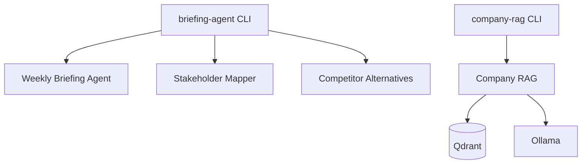
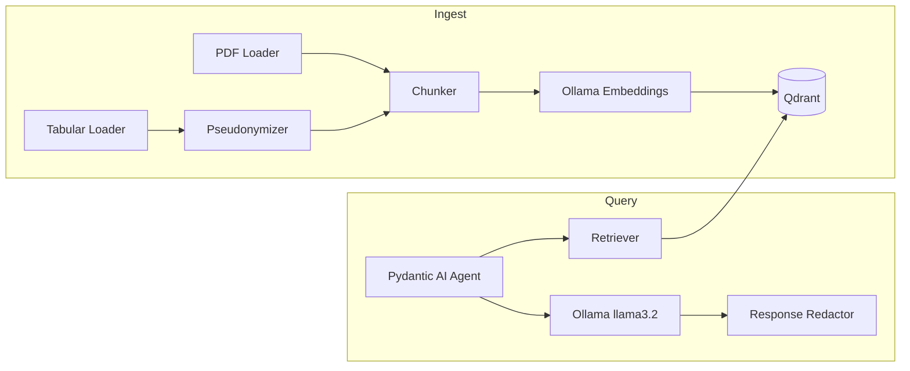

# AI Agent Solutions Portfolio

Production-oriented AI agents for real business workflows: weekly intelligence briefings, stakeholder mapping, competitive research, and GDPR-aware company knowledge retrieval.

Built with **LangGraph**, **Pydantic AI**, **MCP**, local **Ollama**, and **Qdrant**. Each solution is a modular Python package under `src/`, exposed via Typer CLIs, with typed state, structured deliverables, and swappable providers.

---

## What This Demonstrates

| Capability | Where it shows up |
|------------|-------------------|
| **Multi-step agent orchestration** | LangGraph state machines with typed nodes and explicit control flow |
| **Tool use & MCP integration** | DuckDuckGo and LinkedIn MCP servers for live web discovery |
| **Human-in-the-loop** | Approval gate before final briefing output |
| **Structured deliverables** | `.docx` briefings, `.xlsx` stakeholder maps, markdown research packs |
| **Provider flexibility** | OpenRouter or OpenAI via config — no workflow rewrites |
| **Country-aware connectors** | Pluggable stakeholder data sources (UK, India, generic) |
| **GDPR-by-design RAG** | Pseudonymization, role-based access, audit logs, data subject rights CLI |
| **Local-first AI** | Ollama LLM + embeddings, Qdrant on localhost — no external data processors |

---

## Solutions Overview



### 1. Weekly Briefing Agent

Client-specific weekly intelligence briefings from free public sources.

**Flow:** collect sources → rank & deduplicate → enforce source-mix policy → human approval → LLM summary → Word report

**Sources:** RSS feeds, economic indicators (World Bank API), extensible provider registry

**Output:** `.docx` briefing in `outputs/`

```bash
briefing-agent run --client-config config/clients/your_client.yaml
```

### 2. Stakeholder Mapper

Political and policy stakeholder maps for government affairs and public affairs teams.

**Flow:** build org profile → infer policy areas (with confirmation) → country connector discovery → merge, dedupe, score → Excel + markdown export

**Connectors:** UK, India, and generic fallback

**Output:** `.xlsx` workbook (executives, parliamentarians, groups/committees, audit log) plus optional markdown

```bash
briefing-agent stakeholder-map --client-config config/clients/your_client.yaml
```

### 3. Competitor Alternatives

Sales-ready competitor research packs using live MCP tool calls.

**Flow:** load client snapshot → parallel MCP discovery (local / similar / adjacent) → rank & bucket → gap analysis → priority actions → markdown report

**MCP tools:** DuckDuckGo search + fetch, LinkedIn people search (`config/tools_config.json`)

**Output:** Markdown report in `outputs/` — competitor buckets, strengths vs gaps, 30-day actions

```bash
briefing-agent competitor-alternatives --client-config config/clients/your_client.yaml
```

### 4. Company RAG CLI

GDPR-compliant RAG over HR policy PDFs and structured workforce CSVs — for AI on sensitive internal data without sending it to third-party APIs.

**Stack:** Pydantic AI agent · Ollama (`llama3.2:3b` + `nomic-embed-text`) · Qdrant · Typer CLI

**Dataset** (`src/rag/dataset/`):

| File | Content |
|------|---------|
| `hr_policy_detailed_5_pages.pdf` | HR policy document |
| `employees.csv` | ~3,500 employee records |
| `departments.csv`, `locations.csv` | Org structure metadata |
| `org_edges.csv` | Reporting relationships |
| `promotions.csv`, `salaries_annual.csv` | Career and compensation data |

**Architecture:**



**Privacy controls:**

- HMAC pseudonymization at ingest (`Employee-{token}` before embedding)
- Role-based access: `employee` · `hr_admin` · `dpo`
- Data subject rights: `export`, `erase`, `audit`, `purge-expired`
- Append-only audit log (hashed queries by default)
- Local-only: Ollama on host, Qdrant bound to `127.0.0.1`
- Full processing notice: [`src/rag/PRIVACY.md`](src/rag/PRIVACY.md)

```bash
company-rag ingest
company-rag ask "What is the remote work policy?"
company-rag ask "How many employees are in Data Engineering?"
company-rag ask "Who manages employee ID 6?" --role hr_admin
company-rag export --employee-id 6 --role dpo
company-rag erase --employee-id 6 --role dpo --confirm
```

---

## Tech Stack

| Layer | Technologies |
|-------|-------------|
| Agent orchestration | LangGraph, Pydantic AI |
| CLI | Typer (`briefing-agent`, `company-rag`) |
| LLM providers | OpenRouter / OpenAI (briefing agents); Ollama (RAG) |
| Tool protocol | MCP via `langchain-mcp-adapters` |
| Vector store | Qdrant |
| Embeddings | Ollama `nomic-embed-text` |
| Document processing | pypdf, langchain-text-splitters |
| Outputs | python-docx, openpyxl |
| Config | YAML client profiles, pydantic-settings |
| Package management | uv, setuptools |

---

## Project Structure

```
src/
├── briefing_agent/                 # Weekly briefing
│   ├── graph.py
│   ├── sources/                    # RSS, economic, providers
│   ├── models/llm.py               # OpenRouter / OpenAI
│   └── output/docx_writer.py
├── stakeholder_mapper_agent/       # Stakeholder mapping
│   ├── graph.py
│   ├── connectors/                 # UK, India, generic
│   └── output/                     # xlsx + markdown
├── competitor_alternatives_agent/  # Competitor research
│   ├── graph.py
│   ├── discovery.py                # MCP-powered search
│   ├── mcp_tools.py
│   └── output/report_markdown.py
└── rag/                            # Company RAG (GDPR-aware)
    ├── cli.py                      # company-rag entry point
    ├── agent.py                    # Pydantic AI + retrieval tool
    ├── ingest.py                   # PDF/CSV → embed → Qdrant
    ├── privacy/                    # Pseudonymizer, redactor, audit, retention
    ├── embeddings/                 # Ollama embeddings client
    ├── vectorstore/                # Qdrant store
    ├── loaders/                    # PDF + tabular loaders
    ├── PRIVACY.md
    └── dataset/                    # HR PDF + workforce CSVs

config/
├── industries.yaml                 # Industry presets
└── tools_config.json               # MCP server definitions

docker-compose.qdrant.yml           # Localhost-bound Qdrant
tests/
```

---

## Setup

**Requirements:** Python 3.10+, [uv](https://docs.astral.sh/uv/) (recommended). For RAG: [Docker](https://docs.docker.com/) and [Ollama](https://ollama.com/).

```bash
git clone <repo-url>
cd ai-project
uv sync
uv pip install -e .
```

Create a `.env` in the project root as needed:

```env
# Briefing agents
OPENROUTER_API_KEY=your_key
# OPENAI_API_KEY=your_key

# Company RAG (optional overrides; sensible defaults exist)
OLLAMA_BASE_URL=http://localhost:11434
OLLAMA_LLM_MODEL=llama3.2:3b
OLLAMA_EMBEDDING_MODEL=nomic-embed-text:latest
QDRANT_HOST=localhost
QDRANT_PORT=6333
QDRANT_COLLECTION_NAME=company_info
GDPR_PSEUDONYMIZE=true
GDPR_PSEUDONYM_SALT=change-me-in-production
GDPR_SENSITIVITY=standard
GDPR_RETENTION_DAYS=365
RAG_DEFAULT_ROLE=employee
```

**Client configs:** YAML files under `config/clients/` (gitignored). Provider switch — no code changes:

```yaml
provider: openrouter
model: meta-llama/llama-3.2-3b-instruct:free
fallback_models:
  - google/gemma-2-9b-it:free
```

---

## Usage

### Weekly briefing

```bash
briefing-agent run --client-config config/clients/your_client.yaml
```

Collects sources, ranks them, prompts for approval, writes `.docx` to `outputs/`.

### Stakeholder map

```bash
briefing-agent stakeholder-map --client-config config/clients/your_client.yaml
```

Produces `.xlsx` (and often markdown) with executive, parliamentary, and committee tabs plus an audit log.

### Competitor alternatives

Configure MCP servers in `config/tools_config.json`, then:

```bash
briefing-agent competitor-alternatives --client-config config/clients/your_client.yaml
```

| Variable | Default | Purpose |
|----------|---------|---------|
| `MCP_TOOLS_CONFIG` | `config/tools_config.json` | MCP config path |
| `DDG_MCP_SEARCH_TOOL` | `search` | DuckDuckGo search tool |
| `DDG_MCP_FETCH_TOOL` | `fetch_content` | DuckDuckGo fetch tool |
| `LINKEDIN_MCP_SEARCH_TOOL` | `search_people` | LinkedIn search tool |
| `LINKEDIN_MCP_CHROME_PATH` | — | Browser binary for LinkedIn MCP |
| `LINKEDIN_MCP_USER_DATA_DIR` | — | Browser profile directory |
| `LINKEDIN_MCP_NO_HEADLESS` | — | Set `1` to show browser |

### Company RAG

```bash
# 1. Vector store (localhost only)
docker compose -f docker-compose.qdrant.yml up -d

# 2. Local models
ollama pull llama3.2:3b
ollama pull nomic-embed-text:latest

# 3. Ingest dataset (pseudonymizes by default)
company-rag ingest

# 4. Ask / chat / examples
company-rag ask "What is the probation period for new hires?"
company-rag ask "How many employees are in Data Engineering?"
company-rag chat --role employee
company-rag examples

# 5. HR admin (audited) and data subject rights (DPO)
company-rag ask "Who manages employee ID 6?" --role hr_admin
company-rag export --employee-id 6 --role dpo
company-rag erase --employee-id 6 --role dpo --confirm
company-rag audit --since 2026-01-01 --role dpo
company-rag purge-expired --role dpo
```

---

## Testing

```bash
uv run pytest
```

---

## Design Principles

1. **Config over code** — YAML and env drive providers, models, and privacy settings.
2. **Typed state** — LangGraph workflows use explicit `TypedDict` state.
3. **Modular packages** — each agent owns its graph, types, and writers.
4. **Free / local sources first** — RSS, public APIs, MCP, and on-prem Ollama before paid cloud LLMs for sensitive data.
5. **Human checkpoints** — approval where automated output needs review before delivery.
6. **Privacy by design** — workforce data is treated as GDPR personal data: minimize, pseudonymize, audit, and support erasure.

---

## License

Private portfolio project. Contact the author for collaboration or custom agent development.
